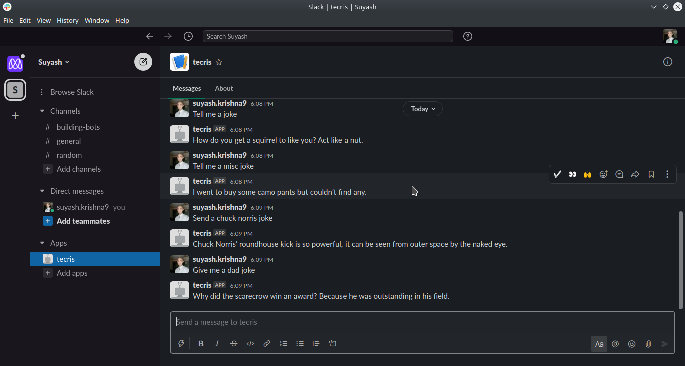
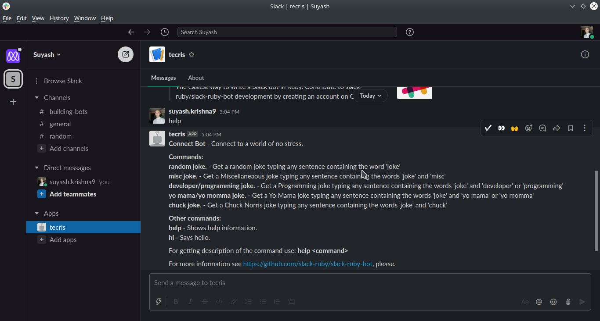

# Connect Bot

> Connect Bot is a funny bot that tells you a joke.

## Description

Anytime you're bored, Connect Bot connects you to a world of no stress. It gives you a joke when you ask it for one.

## How to install

1. Run `git clone https://github.com/krishnzzz/connect_bot.git` on your terminal.
2. Make sure you have Ruby and Bundle installed.
3. Open terminal from the root directory of the cloned project.
4. Run `bundle install` to install all packages.
5. Make sure you have a slack account and you have a personal workspace in which you would want to install the bot.
6. Go to http://slack.com/services/new/bot
7. Create a new bot with a unique username.
8. You will be re-directed, where you will obtain a Slack API Token.
9. Create a '.env' file in the root directory of the cloned project and write `SLACK_API_TOKEN=`, then copy and paste the Slack API Token.
10. Run `rackup` in the terminal.
11. Go to your slack workspace, and you will find the bot with the username you put.
12. Click on the bot and send any message containing the word `joke` (For e.g: Tell me a joke) and enjoy nice jokes that will light up your mood.

## Built With

- Ruby
- Ruby Slack Bot
- RSpec
- Linter
- VScode

## Contributing

Contributions, issues and feature requests are welcome! Start by:

  - Forking the project
  - Cloning the project to your local machine
  - cd into the project directory
  - Run git checkout -b your-branch-name
  - Make your contributions
  - Push your branch up to your forked repository
  - Open a Pull Request with a detailed description to the development branch of the original project for a review

## Author

👤 Suyash Fowdar
- Github: [@Krishnzzz](https://github.com/krishnzzz)
- Twitter: [@Krishnzzz](https://twitter.com/Krishnzzz)
- LinkedIn: [Suyash Fowdar](https://www.linkedin.com/in/suyash-fowdar-22b89514a/)

## Show your Support
Give a ⭐ if you like this project!
